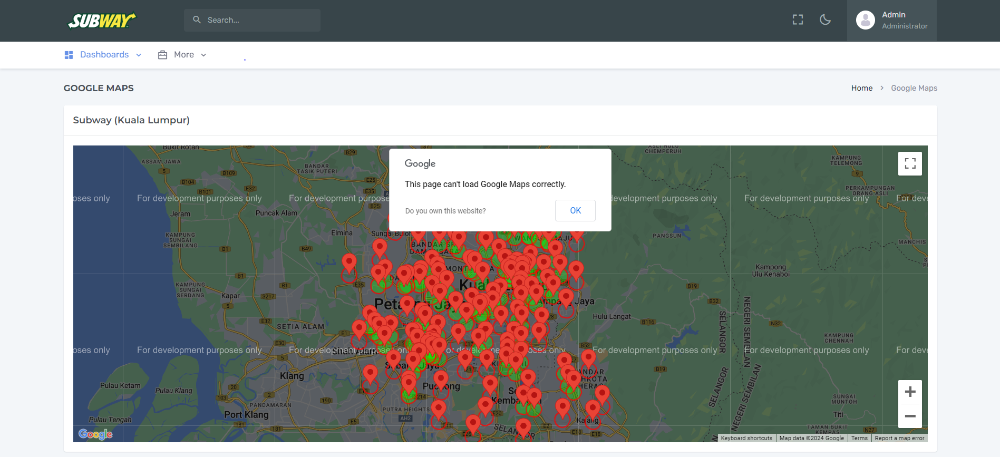

# Subway Discovery Project

## <ins>Introduction</ins>
This project aims to visualize Subway outlets in Kuala Lumpur. Through web scraping, geocoding retrieval, API development, and front-end development, this project provides an interactive map interface for exploring Subway locations in the city. LLM (Large Language Model) will be implemented to assist users in answering specific questions, such as finding the nearest Subway location.

## <ins>Implementation/ Technology</ins>
Technologies Used:

- Database: SQLite
- Web Scraping: Selenium, BeautifulSoup4
- Backend Development: Flask
- Frontend Development: React.js (Velzon Template)
- LLM: LLaMA

## <ins>Methodology/ Approach</ins>
The Haversine formula has been utilized to calculate the radius of locations in order to determine if they intersect. For further reference, the source can be accessed via https://www.geeksforgeeks.org/haversine-formula-to-find-distance-between-two-points-on-a-sphere/. Similar calculation have been applied in `frontend/react/src/pages/Home/index.js`

Google Maps API within React.js has been utilized to visualize the geolocation. Below is the code snippet used to represent a radius of 1 kilometer, where 1000 units equal 1 kilometer.
<br>
```
    <Circle
        key = {index}
        radius = {1000} // 1km
        center = {{ lat: outlet.latitude, lng: outlet.longitude }}
        strokeColor = '#FF0000'
        strokeOpacity = {0.8}
        strokeWeight = {2}
        fillColor = {outlet.intersectedOutlets.length > 0 ? '#00FF00' : 'transparent'}
    />
```

## <ins>Instruction</ins>
Follow these steps to run the project.

<ins>Step 1: Setup Environment</ins>
<br>
Set up your Conda environment and install the necessary libraries, execute the following command in your command prompt:
<br>
`conda create --name yourenv python=3.10`
<br>
`conda activate yourenv`
<br>
`pip install -r requirements.txt`

<ins>Step 2: Database Creation</ins>
<br>
Refer to either `creating_database.ipynb` or `creating_database.py` for the database setup process. Please note that running this code will remove any existing database and create a new one.

<ins>Step 3: Web Scrapping & Data Population</ins>
<br>
For the web scraping process and data population, please refer to `scraping.ipynb` or `scraping.py`.

<ins>Step 4: Backend Implementation</ins>
<br>
To execute the API, refer to the `backend/api.py` file. Once running, the data can be accessed locally at http://127.0.0.1:5000/get_outlets.

<ins>Step 5: Frontend Implementation</ins>
<br>
To launch the user interface, navigate to the `frontend/react` directory. Use `yarn install` followed by `yarn start` for setup and launch. Please avoid using `npm install` as it may lead to significant errors.

## <ins>Result</ins>
Here is a look at the user interface for the map visualization of outlets.


Below is the full visual representation of the geolocation of Subway outlets, including their radius and intersections.


## <ins>Issue/ Challenge</ins>
The intersection logic (Haversine formula) used to determine if two circles (representing outlets) intersect within a 1 km radius, is not precise. The condition `distance <= 1` is supposed to check if the distance between two outlets is less than or equal to 1 kilometer, but it fails to do so accurately. However, through experimentation, it was found that the condition `distance <= 2` correctly identifies the intersection. Further investigation will be carried out to address this discrepancy thoroughly.

## <ins>Ongoing Checklist</ins>
- LLM (LLaMA) chatbot to answer user`s specific question.